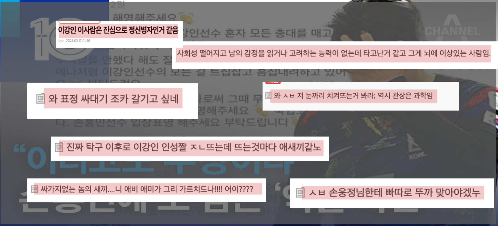
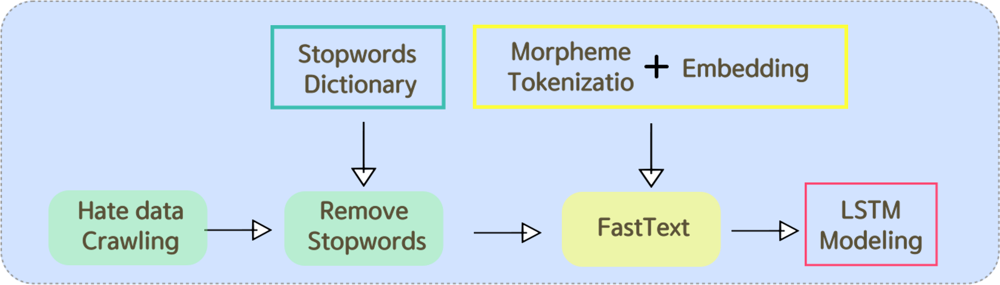
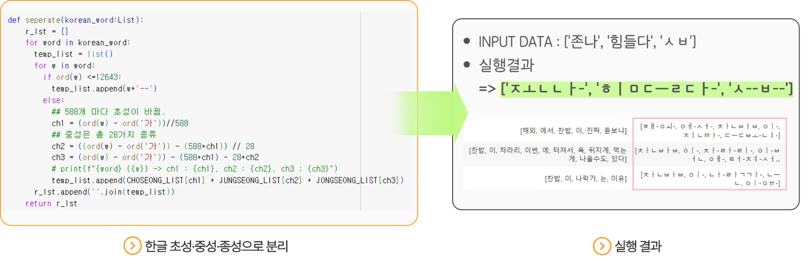
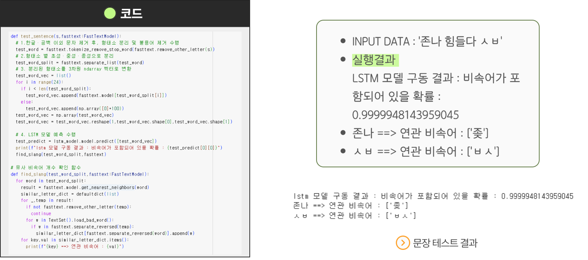
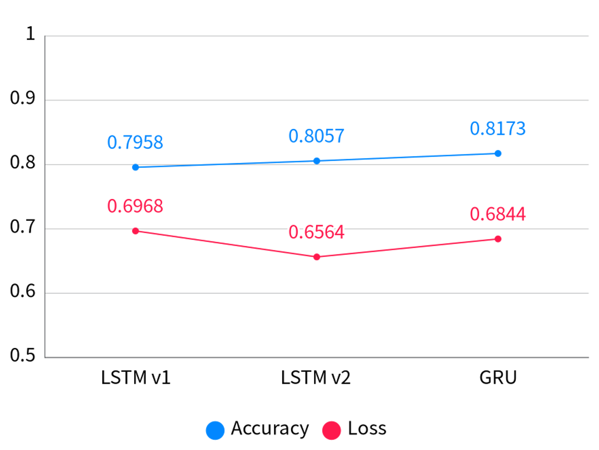
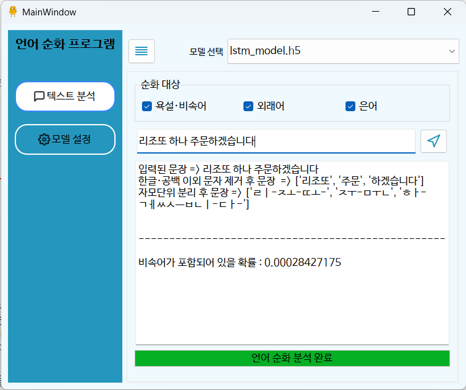
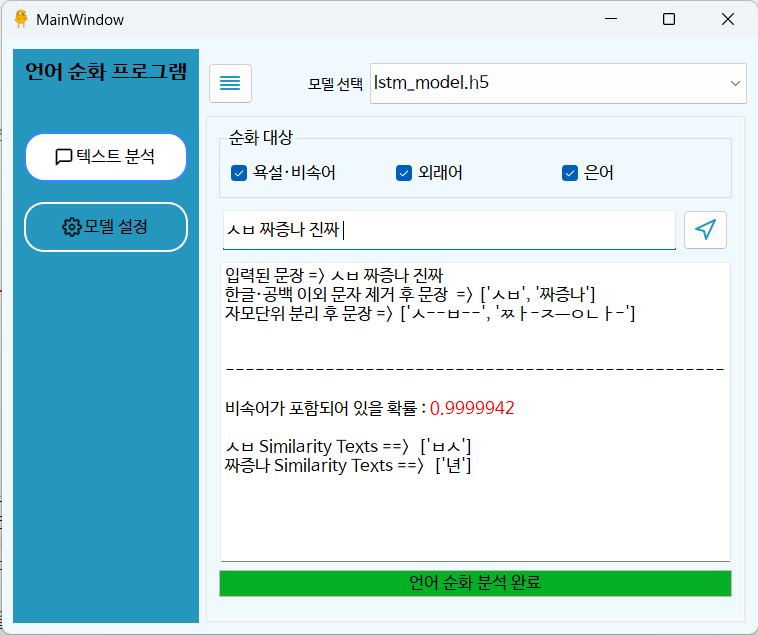
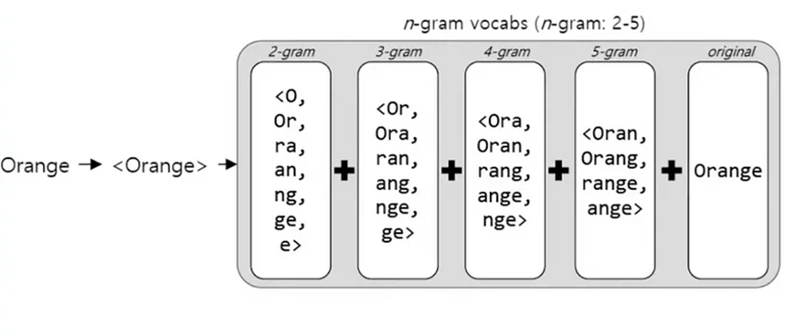
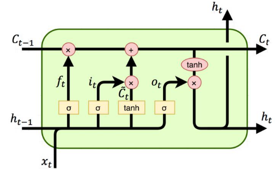

# PROJECT : 언어순화 프로젝트

  

## 📆 프로젝트 기간 

| 날짜 | 업무 내용 |
| --- | --- |
| 2023.02.15 ~ 2023.02.16 | 프로젝트 기획, 주제 선정, 자료 조사 |
| 2023.02.16 ~ 2023.02.18 | 데이터 수집 및 정제(한국어 비속어 • 커뮤니티 게시글 및 댓글 데이터 수집 및 정제) |
| 2023.02.18 ~ 2023.02.20 | NLP Modeling(FastTExt, LSTM) |
| 2023.02.20 ~ 2023.02.21 | PyQt GUI 구현 및 발표자료 작성 |

  

## 🕺 구성원

| 구성원 | 깃허브 주소 | 분담 역할 |
| --- | --- | --- |
| 강재전 | https://github.com/KangJJ63 | 한국어 비속어  • 커뮤니티 게시글 및 댓글 데이터  수집 및 데이터 라벨링,   FastText 데이터 임베딩, PyQt 구현 |
| 구성준 | https://github.com/KOO-96 | 커뮤니티 게시글 및 댓글 데이터  수집 및 데이터 라벨링,   LSTM 모델 구축 |
| 장윤영 | https://github.com/Jyundev | 한국어 비속어  • 커뮤니티 게시글 및 댓글 데이터  수집 및 데이터 라벨링,    FastText 데이터 임베딩 |

  

## 🖥️ Stack

- **Language** : Python
- **Library & Framework** : Colab, Tensorflow, Fasttext, Sklearn, PyQt
- **Environment**
    
    
    | Env | CPU | GPU | RAM | OS |
    | --- | --- | --- | --- | --- |
    | Local | i3-5005U | RTX-3070Ti | 4G | Window10 |
    | Colab | intel Xeon | T4 GPU | 12G | Ubuntu |

  

## Contents Table

- [프로젝트 개요](#📑-프로젝트-개요)
- [기대 효과](#🛎️-기대-효과)
- [프로젝트 설명](#✒️-프로젝트-설명)
- [모델 설명](#✒️-모델-설명)
- [Dataset](#📁-dataset)
- [Reference](#📌-reference)

  

## 📑 프로젝트 개요

  
  

    이강인(23·파리 생제르맹)에 대해 커뮤니티에 달린 비난 댓글
  

 

최근 아시안컵에서의 결과에 대해 선수들과 감독에게 지나친 비난이 발생한 일이 있었습니다. 댓글 문제에 대응하기 위해 네이버와 카카오는 2004년 댓글 서비스를 시작한 이후 댓글 개수 제한, 댓글 이력 공개, 댓글 어뷰징 방지 시스템 도입, AI 기반 필터링 적용 및 고도화, 그리고 연예·스포츠 뉴스 댓글 폐지 등 다양한 방식으로 노력하고 있지만, 이러한 노력들이 근본적인 해결책이 되지 못하고 있습니다.

한국의 네티즌들은 댓글을 통해서 정보를 얻는 것보다는 주로 재미와 흥미를 추구한다는 조사 결과가 있습니다. (한국리서치, 2021) 이에 따라 본 프로젝트는 비속어를 탐지하여 순화된 언어로 변환하여 악플을 예방하고, 악플을 다는 행위 자체에 흥미를 잃게 만드는 것을 목적으로 합니다. 이를 통해 건전한 토론과 의견 교환이 가능한 환경을 조성하고자 합니다.

  

## 🛎️ 기대 효과

- 악플 방지
    
    > 비속어를 감지하고 순화된 언어로 변환함으로써 악성 댓글이나 욕설 등의 부적절한 코멘트를 방지합니다.
    > 
- 청정한 댓글 환경 조성
    
    > 악플을 다는 행위에 흥미를 잃게 만듦으로써, 악플러들이 부적절한 언어를 사용하는 것을 억제할 수 있습니다. 이를 통해, 온라인 공간의 사용자들이 더욱 건전하고 즐거운 경험을 할 수 있도록 도와줍니다
    > 
        

  

## ✒️ 프로젝트 설명

  

### [데이터 전처리]

- 데이터 별 욕설 여부 라벨링
- 한글·공 외 영어 및 특수문자 제거
- 불용어 제거 및 형태소 분리
- 형태소 별 초성·중성·종성 분리
    - 댓글 일부분은 “ㅅㅂ”, “ㅄ” 등 초성으로만 이루어진 비속어가 존재합니다. 따라서, 단어가 아닌 자모단위로 분석하기 위해 한국어를 초성·중성·종성으로 분리하였습니다.
    

  

### [모델 개발]

- 한글의 형태적인 정보를 학습하여, n-gram(n=5) 단어 단위로 임베딩 할 수 있는 FastText모델 생성했습니다.
- 벡터화된 수치 데이터를 사용하여 비속어 여부를 학습하고 예측하기 위한 LSTM 모델을 수립했습니다.

  

### [성능 비교]

- 성능 비교를 위해 LSTM 모델  두 가지와  GRU 모델을 사용했습니다.
- LSTM 모델은 LSTM 레이어의 개수를 다르게 설정하여 두 가지 버전으로 분류하였습니다.

  

### [실행 결과]

PyQt GUI 프레임워크를 활용하여 사용자가 직접 분석을 수행할 수 있는 인터페이스를 구현했습니다.

  
  

  

## ✒️ 모델 설명

### FastText

FastText는 Facebook에서 개발한 기술로, 단어를 n-gram의 하위 단어 집합으로 학습하고, 이들을 결합하여 단어의 전체 임베딩을 생성합니다.

  

 

FastText를 사용한 이유는 다음과 같습니다.

- 한국어는 조사 등의 불규칙한 형태소로 구성되어 있습니다. 특히 욕설 데이터는 띄어쓰기가 잘 지켜지지 않으며, 때에 따라 초성으로만 이루어진 비속어들이 존재합니다.
- 비슷한 발음 등 어휘 정보를 가진 신조어의 특성에 따라, Word2Vec의 경우 단어가 모델에 없으면 이를 처리하기가 어렵습니다. 반면, FastText 모델은 하위 단어들을 이용하여, 모델에 없는 단어도 유사한 단어들의 정보를 활용하여 임베딩을 생성해 다양한 경우의 수를 고려함으로써 OOV(Out Of Vocabulary)문제를 효과적으로 해결할 수 있습니다.

 

### **LSTM (Long short-Term Memory)**

순환신경망(RNN)의 한 종류로, 장기 의존성 문제를 해결하기 위해 고안되었습니다. 기존의 RNN은 긴 시퀀스 데이터에서 장기적인 의존성을 제대로 학습하지 못하는 문제가 있었습니다. LSTM의 경우 이 문제를 해결하기 위해 cell 상태와 게이트 메커니즘을 도입하여 장기 의존성을 학습할 수 있도록 설계되었습니다.

  

### LSTM의 구성 요소

#### 1. cell state : LSTM의 핵심 메모리 유닛으로 정보가 전달되는 곳

셀 상태는 기간이 지나면서 정보를 저장하거나 삭제를 할 수 있습니다.

#### 2. Gates  : LSTM은 게이트 메커니즘을 통해 흐름을 제어합니다.

- Forget gate(망각 게이트) : 과거 정보를 잊거나 기억하기 위한 결정을 하는 게이트

- Input gate(입력 게이트) : Forget gate에서는 과거의 정보를 결정했다면 Input 게이트에서는 현재 정보를 잊거나 기억하기 위한 결정을 하는 게이트

- Output gate(출력 게이트) : 현 시점의 Hidden state는 현 시점의 cell state와 함께 계산되며 출력과 동시에 다음 시점의 Hidden state로 넘깁니다.

#### 3. Hidden State(은닉 상태) 
 LSTM의 출력으로 사용되는 값으로, 현재의 입력과 이전 시간 단계의 은닉 상태에 의해 결정됩니다. 
 
 은닉 상태는 현재의 정보를 담고 있으며, 다음 상태의 단계로 전달 됩니다.

  

## 📁 Dataset
| Title | link |
| --- | --- |
| 한국어 혐오 데이터셋 | <a href = https://github.com/kocohub/korean-hate-speech>korean-hate-speech</a> |
| 일베·오늘의 유머 사이트의 욕설 데이터셋 | <a href = https://github.com/2runo/Curse-detection-data>Curse-detection-data></a>|
| 디시인사이드·네이트판 등에서 수집한 욕설 데이터 | - |
| 나무위키 한국어 욕설 정보 | <a href = https://namu.wiki/w/%EC%9A%95%EC%84%A4/%ED%95%9C%EA%B5%AD%EC%96%B4> 나무위키/욕설/한국어</a> |
| 직접 제작한 불용어 사전 | - |

  

## 📌 Reference

| Reference | Git | paper_link |
| --- | --- | --- |
| Swear Word Detection Method Using The Word Embedding and LSTM |  | <a href = https://oak.chosun.ac.kr/bitstream/2020.oak/16586/2/%EB%8B%A8%EC%96%B4%20%EC%9E%84%EB%B2%A0%EB%94%A9%EA%B3%BC%20LSTM%EC%9D%84%20%ED%99%9C%EC%9A%A9%ED%95%9C%20%EB%B9%84%EC%86%8D%EC%96%B4%20%ED%8C%90%EB%B3%84%20%EB%B0%A9%EB%B2%95.pdf>paper</a> |
| FastText:Library for efficient text classification and representation learning | <a href = https://github.com/facebookresearch/fastText>FastText</a> | <a href = https://fasttext.cc/>paper</a> |
| The Unreasonable Effectiveness of Recurrent Neural Networks | <a href = https://github.com/karpathy/char-rnn > char-rnn</a>| <a href= https://karpathy.github.io/2015/05/21/rnn-effectiveness/>paper</a>|